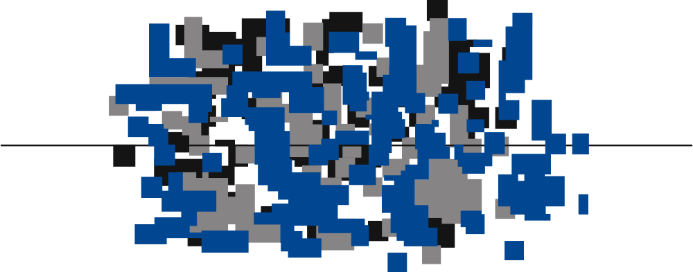

# GeoReDUS: Indicadores Educacionais - Ideb

<!-- badges: start -->

<!-- badges: end -->

Este repositório apresenta um fluxo reproduzível em R para download, tratamento, integração e geocodificação dos dados do **Índice de Desenvolvimento da Educação Básica** (IDEB) por escola para o ano de 2023, combinando resultados oficiais do INEP com os microdados do Censo Escolar.

Site do projeto: https://georedus.github.io/inep-ideb/

## Objetivo

Produzir uma base consolidada contendo:

- Identificação da escola 
- Indicadores do IDEB por etapa de ensino
- Informações territoriais 
- Coordenadas geográficas
- Identificação da origem da geocodificação

Este projeto integra o desenvolvimento da plataforma [GeoReDUS](https://www.redus.org.br/georedus).

## Fontes de dados

O repositório utiliza as seguintes fontes oficiais:

- Resultados do [IDEB](https://www.gov.br/inep/pt-br/areas-de-atuacao/pesquisas-estatisticas-e-indicadores/ideb) por escola (INEP)
- [Microdados do Censo Escolar](https://www.gov.br/inep/pt-br/acesso-a-informacao/dados-abertos/microdados/censo-escolar)
- [Catálogo de escolas](https://www.gov.br/inep/pt-br/acesso-a-informacao/dados-abertos/inep-data/catalogo-de-escolas) com coordenadas geográficas
- Geocodificação complementar via pacote [`geocodebr`](https://github.com/ipeaGIT/geocodebr) (IPEA)

## Etapas do processamento

O fluxo de trabalho compreende:

1. Download e organização dos arquivos do IDEB.
2. Tratamento e padronização das variáveis de interesse.
3. Download e tratamento dos microdados do Censo Escolar.
4. Integração entre IDEB e microdados.
5. Validação e limpeza dos campos de latitude e longitude.
6. Geocodificação complementar das escolas sem coordenadas.
7. Identificação da origem da geocodificação (`modo_geocode`).
8. Exportação da base final em formatos tabular (CSV) e espacial (GeoPackage).
9. Produção de mapas de algumas cidades brasileiras para demonstrar a distribuição espacial das escolas de acordo com os valores do Ideb.

## Observações metodológicas

As coordenadas geradas via `geocodebr` são estimativas obtidas a partir das informações textuais de endereço. A precisão espacial depende da qualidade e detalhamento desses campos (logradouro, número, CEP, município etc.).

Os níveis de precisão variam conforme o tipo de correspondência obtida:
- Número ou número aproximado: maior precisão.
- Logradouro: precisão intermediária.
- CEP, localidade ou município: menor precisão.

As coordenadas imputadas devem ser utilizadas com cautela em análises espaciais de pequena escala, sendo mais adequadas para estudos agregados.

## Reprodutibilidade

Os dados do IDEB são disponibilizados em base consolidada que reúne os ciclos de 2005 a 2023. Assim, a execução do script para um ciclo específico (2023) envolve a seleção e tratamento das variáveis correspondentes dentro dessa base única.

Caso se deseje utilizar o script para outros ciclos (ex.: 2021), não é suficiente alterar apenas o parâmetro de ano. São necessários ajustes na etapa de seleção e tratamento das variáveis, garantindo que os indicadores correspondam corretamente ao ciclo analisado.

Considerando que o IDEB é um indicador de periodicidade **bienal**, recomenda-se explicitar o ciclo de referência em todos os produtos derivados (arquivos exportados, tabelas e mapas), bem como manter controle de versões dos dados brutos e registro das datas de download. Isso é importante porque arquivos oficiais podem ser revisados ou atualizados ao longo do tempo, afetando a comparabilidade entre ciclos.

## Agradecimentos

<table>
  <tr>
    <td width="30%" align="center" valign="middle">
      
    </td>
    <td width="70%" valign="middle">
      Este trabalho foi desenvolvido com o apoio do 
      <strong>Centro de Estudos da Metrópole</strong> 
      (<a href="https://centrodametropole.fflch.usp.br/">CEM</a>), 
      sediado na 
      <strong>Faculdade de Filosofia, Letras e Ciências Humanas</strong> 
      (<a href="https://www.fflch.usp.br/">FFLCH</a>) da 
      <strong>Universidade de São Paulo</strong> 
      (<a href="https://www5.usp.br/">USP</a>) e no 
      <strong>Centro Brasileiro de Análise e Planejamento</strong> 
      (<a href="https://cebrap.org.br/">CEBRAP</a>).
    </td>
  </tr>
</table>

<table>
  <tr>
    <td width="30%" align="center" valign="middle">
      
    </td>
    <td width="70%" valign="middle">
      Este estudo foi financiado, em parte, pela 
      <strong>Fundação de Amparo à Pesquisa do Estado de São Paulo</strong> 
      (<a href="https://fapesp.br/">FAPESP</a>), Brasil. 
      Processo nº 
      <a href="https://bv.fapesp.br/pt/bolsas/232814/analise-da-producao-de-evidencias-geoespaciais-para-politicas-publicas/">
        2025/15643-1
      </a>.
    </td>
  </tr>
</table>
